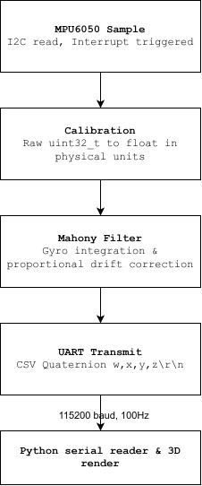

# STM32 IMU Attitude Estimation

Real-time 3D orientation tracking written in C on an STM32F401, using an MPU6050 IMU and a quaternion-based Mahony filter with live visualisation in Python using matplotlib.


## Features

- Register-level MPU6050 driver
- Quaternion and vector maths & world/body rotation frames
- Sensor fusion (Mahony filter: gyro integration + proportional accelerometer drift correction)
- Sensor calibration (gyro bias, accelerometer offset/scale)
- CSV UART telemetry
- Interrupt driven sampling

## How it works

The core of this project is the Mahony filter loop, which corrects gyro drift using gravity as a reference:

```bash
predicted_gravity = rotate(conjugate(attitude), world_down)
error             = crossproduct(measured_gravity, predicted_gravity)
gyro_rate        += KP * error   # converted to matching units
attitude          = attitude * delta_quaternion(gyro_rate, dt)
```

Getting this right meant tracking down three separate, non-obvious bugs: the rotation frame direction, a radians/degrees unit mismatch, and a feedback sign error that (very satisfyingly) caused the filter to converge confidently to upside-down rather than level.

<details>
<summary>Data flow diagram</summary>



</details>

### Algorithm Explained

This project uses a simplified version of the Mahony filter. Raw sensor data is read from the IMU and calibrated giving acceleration and angular velocity vectors:

$$
\bold a = [a_x,a_y,a_z]\; (\text{g})\\
\boldsymbol\omega = [\omega_x, \omega_y, \omega_z]\; (\degree/\text{s})
$$

The acceleration vector is normalised to give a unit vector pointing in the **measured** direction of gravity*
$$
\bold {\hat{g}}_m = \frac{\bold a }{||\bold a||}
$$
**Note: This assumes linear acceleration due to the movement of the IMU is negligible compared to gravity* 

The current attitude quaternion, $\bold q_k$, represents the rotation from the body frame to the world frame, and is used to calculate a **predicted** gravity vector based on the world down direction in the body frame:
$$
\bold{\hat{g}}_p = \bold q^*_k\otimes \bold{\hat{g}}_w  \otimes \bold q_k \\[10pt]
\text {where }\bold {\hat{g}}_w= [1,0,0] \text{, the world down vector, and $\bold q ^*_k$ is the conjugate of $\bold q_k$}
$$

The error is then simply the cross product of the measured and predicted gravity vectors:
$$
\bold e = \bold{\hat{g}}_m\times\bold{\hat{g}}_p
$$
Its direction represents the axis of rotation between the two vectors, while its magnitude is proportional to the sine of the angular error.

The error is scaled by $\dfrac {180} \pi$ so that the proportional correction is expressed on the same angular scale as the gyro measurements:
$$
\boldsymbol\omega_{\text{corrected}} = \boldsymbol\omega + K_p\frac{180}{\pi}\bold e
$$


The corrected gyro measurements are integrated and used to construct the delta quaternion $\delta \bold q$.
$\text{d}t$ is converted from $\text{ms}$ to $\text{s}$
$$
\delta\boldsymbol{\theta} = \text{d}t\frac{\pi}{180000}\boldsymbol\omega_{\text{corrected}}\\[10pt]
\theta = ||\delta\boldsymbol\theta||\\[5pt]
\bold{\hat{u}} = \frac{\delta\boldsymbol\theta}{||\delta\boldsymbol\theta||}\\[5pt]
\delta\bold q =\left[\cos\left(\frac\theta 2\right), \bold{\hat{u}}\sin\left(\frac\theta 2\right)\right]
$$

Finally, the attitude estimation is updated by multiplying the current attitude quaternion with the delta quaternion.
$$
\bold q_{k+1} = \bold q _{k}\otimes\delta\bold q
$$

## Known limitations / Future improvements

- Uncorrected yaw drift (MPU6050 has no concrete heading reference point)
- Gain is not yet perfectly tuned; error doesn't correct as fast as I'd like
- Proportional-only correction (no integral term)
- CSV telemetry rather than binary framing
- Currently uses ```HAL_GetTick()``` for timing which has a 1ms resolution
    - This is sufficient at the current 100Hz sample rate, but a hardware timer will be needed for 

## Hardware
This project uses an STM32-F401RE dev board and a MPU6050 breakout board wired as such:
```
STM32   | MPU6050
-----------------
3V3     |     VCC
GND     |     GND
PA1     |     INT
SCL     |     SCL
SDA     |     SDA
```
PA1 must have EXTI interrupts enabled within STM32CubeMX
## Usage
Wire up your STM32F401 or compatible and MPU6050 as shown above, connect to your PC via USB, then flash firmware via STM32CubeIDE or the VSCode STM32 extension.

```bash
pip install matplotlib pyserial
python python/visualisation.py
```
The serial port used can be entered manually as an argument, e.g.
```
python python/visualisation.py COM3
```
But the program will automatically select the serial port if only one is available, or give you a list to choose from if multiple are available.

## Attribution

Firmware and sensor fusion are original work. The Python visualization script was built with AI assistance from a spec I wrote (matplotlib rendering, axis remapping, threaded serial reader).


